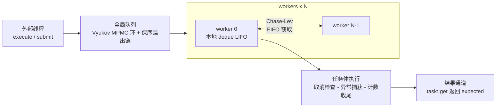

# ThreadPool


C++26 高性能线程池: 工作窃取调度 + 无锁队列 + 函数式任务组合, 全库 API 零异常

## 基准

同机对比 [Taskflow](https://github.com/taskflow/taskflow) 与 [BS::thread_pool 5.1](https://github.com/bshoshany/thread-pool)(均按原样引入于 `benchmarks/third_party/`). 统一负载与线程数; 完成判定采用任务内计数器 + 自旋等待, 不依赖任何一方的等待原语. 下表为单进程内每项取 3 轮最优, 再跨 12 次独立运行取中位数

吞吐(百万任务/秒, 越大越好):

| 场景 | Taskflow | BS::thread_pool | 本库 | vs 最优基线 |
|------|---------:|----------------:|-----:|------------:|
| fire-and-forget 单生产者 | 1.44 | 0.37 | **4.51** | **3.13x** |
| submit + 取回结果 | 0.36 | 0.25 | **1.92** | **5.33x** |
| 递归 fork-join(深度 18) | 4.31 | 0.64 | **6.32** | **1.47x** |
| 多生产者竞争 x2 | 2.73 | 0.42 | **5.53** | **2.03x** |
| 多生产者竞争 x4 | 2.73 | 0.70 | **5.37** | **1.97x** |
| 多生产者竞争 x8 | 2.59 | 1.32 | **5.22** | **2.02x** |

延迟(空池 提交 -> 取回 往返, 微秒, 越小越好):

| 分位 | Taskflow | BS::thread_pool | 本库 |
|------|---------:|----------------:|-----:|
| P50 | 2.95 | 4.20 | **0.63** |
| P90 | 4.40 | 5.95 | **0.98** |
| P99 | 6.69 | 7.28 | **1.42** |

延迟是本库优势最稳的一面: 12 次运行中三个分位无一例外, 且本库的离散度也最小(P50 跨运行区间 0.56-0.83µs). 单次最大值(max)三方都受调度抖动支配, 跨运行可差一个数量级, 不列入表内

混合负载与扩展性:

| 场景(ms, 越小越好) | Taskflow | BS::thread_pool | 本库 |
|------|---------:|----------------:|-----:|
| 混合负载: 90% 短任务 + 10% 长任务 | 16.51 | 12.06 | **10.28** |
| 扩展性: 固定实算 x 1 线程 | 12.61 | **12.42** | 12.14 |
| 扩展性: 固定实算 x 2 线程 | 8.04 | 8.34 | **6.96** |
| 扩展性: 固定实算 x 4 线程 | 4.08 | 4.11 | **3.94** |
| 扩展性: 固定实算 x 8 线程 | **2.23** | 2.23 | 2.43 |

扩展性一项由任务体实算量支配, 调度开销被摊薄到可忽略, 因此三方基本持平(各行跨运行区间互相重叠, 中位数差异最大为 2 线程行的 17%). 本库的调度优势只在任务粒度小到调度开销可比时才体现 — 即上面的吞吐与延迟两表

特性组合吞吐(execute 单生产者): 各特性标签单独开启及全开时的相对吞吐:

| 标签组合 | 吞吐(M/s) | 相对无标签 | 跨运行离散度 |
|----------|--------:|-----------:|------------:|
| 无标签 | 5.37 | 1.00x | cv 11% |
| + priority | 4.87 | 0.91x | cv 6.0% |
| + cancellable | 4.90 | 0.91x | cv 11% |
| + trace 未设钩子 | 5.34 | 0.99x | cv 5.1% |
| + trace on_end 空钩子 | 5.08 | 0.95x | cv 5.6% |
| + worker_cap&lt;8&gt; | 4.87 | 0.91x | cv 12% |
| 全部组合 | 4.81 | 0.90x | cv 5.2% |

> 此表不宜按严格序关系解读: 除 trace 两行外, 各行的行间比值逐轮大幅摆动, 排序不稳健. 能站住的结论只有两条 — trace 未设钩子时几乎零代价(相对值 0.99x), 挂上空的 on_end 钩子约 5% 的代价(其两行 cv 仅 5-6%, 且 12 次运行从未超过 5.32 M/s, 而无标签组合可达 6.61); priority / cancellable / worker_cap 的开销小到当前样本量无法分辨

扩展基线([oneTBB](https://github.com/oneapi-src/oneTBB) 2023.1 系统包与 [moodycamel](https://github.com/cameron314/concurrentqueue) 队列自建池; 同机同线程数, 3 次运行的区间):

| 场景 | oneTBB | moodycamel 池 | 本库 |
|------|-------:|--------------:|-----:|
| fire-and-forget 单生产者(M/s) | 3.9–4.5 | 4.0–4.4 | **4.9–5.1** |
| 8 生产者竞争(M/s) | 6.9–7.2 | **9.8–10.6** | 5.0–5.3 |
| 递归 fork-join 深度 18(M leaves/s) | **24–27** | 3.7–4.3 | 5.6–6.6 |
| 分块并行映射 64 grain(ms, 越小越好) | **3.5** | — | 3.9–4.1 |

如实说: 单生产者与稀疏流量(唤醒路径主导)是本库的强项, 延迟更是独一档; 但有两个场景落在后面 — 8 生产者饱和流量下 moodycamel 自建池约快一倍(本库每次提交付 state_ 单字 RMW + seq_cst 栅栏, 4 MiB 环的缓存足迹也大), 递归 fork-join 下 oneTBB 约快 4 倍(TBB 任务几十字节且经每线程池回收, 本库每层派生一次 128B 节点 + 闭包构造). 分块映射与 TBB 基本持平. 这些是已知的结构性差距, 属设计取舍(单字 state_ 换来关闭/等待收敛的强一致)而非缺陷; 高生产者饱和流量可自行改用 `queue_cap` 下调环体积或走批量提交.

> 参考环境: 原生 Linux(内核 6.18), GCC 16.2.1, i7-12650H(6 P-core + 4 E-core, 16 硬件线程), 基准线程数 8, powersave governor, 机器空载. `./build/concurrent_bench [--quick]` 复现
> 早期版本的基准数据测自 WSL2. 其 futex 唤醒路径会显著放大条件变量驱动型线程池的开销, 令两个基线的吞吐与延迟劣化约一个数量级(如 Taskflow 单生产者 0.09 vs 原生 1.61 M/s, P50 延迟 33.15 vs 原生 2.64µs), 而本库的睡前有界自旋恰好绕开该路径, 数值几乎不受影响. 由此得出的领先倍数(曾记为 65x / 31x)是平台伪影, 现已按原生 Linux 实测修正
> 延迟优势的关键设计: worker 睡眠前执行时间预算型有界自旋(默认 64µs, `options::spin_budget` 可调), 吸收成簇到达的任务, 免去 futex 内核往返

## 功能一览

| 特性 | 说明 |
|------|------|
| 工作窃取调度 | 每线程本地 deque(LIFO) + Chase-Lev 窃取(FIFO); 全局侧 Vyukov MPMC 环 + 保序溢出链兜底, 提交永不阻塞, 永不拒绝 |
| 零 throw 契约 | 库自身的失败经 `std::expected` 报告; 任务体异常透传至结果通道; `execute` 编译期强制 `noexcept`. 仅 `submit`/`submit_each` 提交期的用户代码(callable 与实参的拷贝构造)异常原样透传 |
| 函数式组合子 | `task` 支持 `map` / `and_then` / `inspect`, `when_all` 汇合多任务为 `task<tuple<...>>`; 续延链深度守卫, 万级链不爆栈 |
| 惰性批量 | `parallel_map` / `parallel_for` 返回轻量视图, 首次迭代整批入队, 按输入顺序取回 `expected`; 迭代面经 `std::generator`, `results()` 可直接组合 ranges 管道 |
| 分块批量 | `parallel_map_chunked` / `parallel_for_chunked` 每块一任务, 摊薄元素级调度开销, 缓解大区间整批提交的内存尖峰 |
| P2300 scheduler | 可选对接 [stdexec](https://github.com/NVIDIA/stdexec): `ex::as_scheduler(pool)` 暴露标准 sender/receiver 算法组合(构建开关, 核心库零依赖) |
| 可组合特性标签 | `priority`, `cancellable`, `trace`, `worker_cap<N>`, `queue_cap<Global, Local>` 变参无序组合, 编译期开关零抽象税 |
| 协作取消 | 任务可接收 `std::stop_token`; 未开跑即取消的任务体被跳过并以 `operation_cancelled` 标记 |

## 调度架构



## 快速开始

```cpp
#include <concurrent/pool.hpp>
#include <print>

using namespace concurrent;

pool p({.threads = 4});

// 即发即忘, callable 必须 noexcept
(void)p.execute([]() noexcept { /* ... */ });

// 有返回值: submit 返回 expected<task<T>, submit_error>
auto t = p.submit([](int a, int b) { return a + b; }, 10, 20);
if (t && t->get()) {
    std::println("{}", *t->get());
}

// 函数式组合: when_all 汇合多任务, map 变换结果
auto a = p.submit([] { return 100; });
auto b = p.submit([] { return 200; });
if (a && b) {
    auto sum = when_all(std::move(*a), std::move(*b))
                   .map([](auto&& tup) { return std::get<0>(tup) + std::get<1>(tup); });
    if (auto r = sum.get()) {
        std::println("sum = {}", *r);
    }
}
p.wait();
```

## 接口速查

提交接口(`R` 为 callable 返回类型):

| 接口 | 约束 | 返回 |
|------|------|------|
| `submit(f, args...)` | - | `expected<task<R>, submit_error>` |
| `submit(prio, f, ...)` | 需 `priority` 标签 | 同上 |
| `execute(f, args...)` | `f` 必须 `noexcept` | `expected<void, submit_error>` |
| `execute(prio, f, ...)` | 同上 + `priority` 标签 | 同上 |
| `execute(f, ...)` 带 stop_token 形参 | `cancellable` 标签 | `expected<stop_source, submit_error>` |
| `submit_each(range, f)` | 区间每元素一任务, 整批单次唤醒; 元素按值拷贝 | `expected<vector<task<R>>, submit_error>` |

`submit` 的 callable 接受 `const std::stop_token&` 首参即获得协作取消能力, 返回的 `task` 携带 `request_stop()`

task 组合子(均在完成任务的工作线程上内联执行, 结果值恰好可取一次):

| 组合子 | 行为 |
|--------|------|
| `map(f)` | 变换成功值, `f` 接收 `T&&`(void 任务无参), 错误/取消透传 |
| `and_then(f)` | 绑定返回 `task<U>` 的后续操作, 内层结果透传 |
| `inspect(f)` | 旁观副作用, 不改变结果与错误通道 |
| `when_all(tasks...)` | 全部成功 -> `task<tuple<...>>`; 任一失败/取消 -> 以首个错误失败 |

惰性批量与生命周期:

| 接口 | 行为 |
|------|------|
| `parallel_map(p, range, f)` | 惰性视图: 不迭代则不提交; `begin()` 整批入队, 按输入顺序阻塞取回 `expected`; 析构等待全部完成 |
| `parallel_map_chunked(p, range, f, grain)` | 分块版: 每 grain 个元素一块(0 = 按线程数), `f` 对每块调用一次并接收子区间; 大区间优先用此入口 |
| `parallel_for(p, range, f).run()` | 同上, 无返回值版; `.run()` 直接执行并返回首个错误 |
| `parallel_view::results()` | 结果流: 单趟 `std::generator`, 可直接组合 ranges 管道(如 `v.results() \| std::views::take(3)`) |
| `p.wait()` / `wait_for` / `wait_until` | 阻塞至全部完成 / 超时变体. 不得在任务体(worker 线程)内调用 `wait`/`shutdown` - 必死锁, Debug 构建下契约断言终止 |
| `p.shutdown(policy)` | `drain` 排空后退出(析构默认); `discard` 尽力丢弃排队任务并以取消语义终结其结果通道(worker 已取出未开跑的部分可能照常执行); 运行中任务两者都会等待完成(join 固有语义); 两者均放行 worker 内嵌套提交(fork-join 析构安全) |

错误辨识: `is_cancelled(e)` 判取消, `is_invalid_task(e)` 判无效任务句柄, `submit_error_of(e)` 还原提交阶段失败

## 特性标签

变参无序组合, 例如 `basic_pool<decltype(priority), decltype(trace)>`:

| 标签 | 效果 |
|------|------|
| `priority` | high/normal/low 三档分层队列, 消费时高到低扫描(best-effort) |
| `cancellable` | 解锁返回 `stop_source` 的 execute 重载 |
| `trace` | 运行期钩子 `on_enqueue` / `on_begin` / `on_end`(签名强制 `noexcept`), 事件含 id/phase/outcome/priority/worker |
| `worker_cap<N>` | workers 以 `inplace_vector<jthread, N>` 静态存储, 无标签用 `vector` |
| `queue_cap<Global, Local>` | 全局环 / 本地 deque 容量(2 的幂, 缺省 65536 / 256). 环满自动落入保序溢出链, 容量影响内存占用与无锁快路径占比; 大环吸收多生产者积压避免溢出链争用(每槽按缓存行填充, 65536 槽 = 4 MiB/层, 内存敏感时可下调) |

运行期配置 `pool::options`:

| 字段 | 说明 |
|------|------|
| `threads` | worker 数, 0 = `hardware_concurrency()` |
| `spin_budget` | 睡前有界自旋时间预算(默认 64µs, 0 = 不自旋直接睡). 任务到达间隔稳定小于该值时 N 个 worker 全程占核, 稀疏流量的服务型池宜调小 |
| `hooks` | trace 钩子(仅 `trace` 标签下生效) |

## 构建

要求: GCC 16.2+, CMake 3.28+(模块封装需 Ninja)

```bash
cmake -B build -G Ninja -DCMAKE_BUILD_TYPE=Release
cmake --build build

ctest --test-dir build          # 测试
./build/concurrent_example      # 示例
./build/concurrent_bench        # 基准(--quick 缩减规模)
```

| 选项 | 说明 |
|------|------|
| `-DBUILD_MODULE=ON` | 模块封装 `concurrent.pool`(需 Ninja) |
| `-DSANITIZER=address\|thread` | 叠加 UBSan 的消毒器构建 |
| `-DWITH_STDEXEC=ON -DSTDEXEC_ROOT=<path>` | P2300 scheduler 集成测试(独立目标; path 为含 `stdexec/` 的包含根) |

契约(Contracts)在 Debug 下 enforce, 其余配置 ignore(零开销). 配置即生成 `compile_commands.json` 并软链到仓库根目录

模块封装: `-DBUILD_MODULE=ON` 构建后即可 `import concurrent.pool;`. 注意标准库文本包含须置于 `import` 之前(GCC 16 工具链限制), 完整示例见 `module/smoke.cpp`

### stdexec(P2300)可选面

核心库零依赖; 需要 sender/receiver 生态(`then` / `when_all` / `split` / 标准算法)时:

```cpp
#include <concurrent/execution.hpp>   // 提供 stdexec 的 TU 须先自行引入该库

concurrent::pool p({.threads = 4});
auto sched = concurrent::ex::as_scheduler(p);

using namespace stdexec;
auto [v] = sync_wait(sched.schedule() | then([] { return 42; })).value();
```

池已关闭时 `schedule` 以 `set_stopped` 完成; 续延异常经 `set_error` 送达(`sync_wait` 按 P2300 约定重抛, 与本库组合子的 `expected` 通道不同). 组合子(`map` / `and_then` / `when_all`)是零依赖路径的唯一选择, 两套面并存各取所长

## 测试

测试基于 [doctest](https://github.com/doctest/doctest)(单头, 零依赖), 覆盖提交语义, 优先级, 取消, 异常通道, 生命周期, 组合子, 惰性批量与无锁容器并发回归:

| 构建 | 结果 |
|------|------|
| Release(契约 ignore) | 通过, 零警告 |
| Debug(契约 enforce) | 通过, 零警告 |
| `-DSANITIZER=address` | 无报告 |
| `-DSANITIZER=thread` | 无库代码报告 |

TSan 抑制清单 `tests/tsan.supp` 由 CTest 自动挂载, 仅滤除 libubsan/libstdc++ 运行时自扰, 库代码零抑制

## 目录结构

```text
include/concurrent/          公共头文件(header-only 主交付)
  pool.hpp                   basic_pool<Flags...> 与生命周期
  task.hpp                   task<T>, 共享状态与组合子续延
  parallel.hpp               惰性批量视图与分块入口
  execution.hpp              stdexec (P2300) scheduler 适配(可选依赖)
  tags.hpp / trace.hpp       特性标签与调试钩子
  detail/                    chase_lev / global_queue / mpmc_ring / sbo_function / spinlock
module/concurrent.cppm       模块封装(concurrent.pool)
tests/                       doctest 用例与公共工具
benchmarks/bench.cpp         开源基线对比 + 特性组合吞吐
src/main.cpp                 快速示例
```

## 协议

[MIT](LICENSE)
